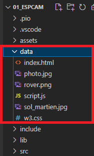
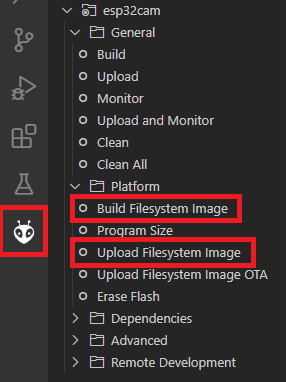
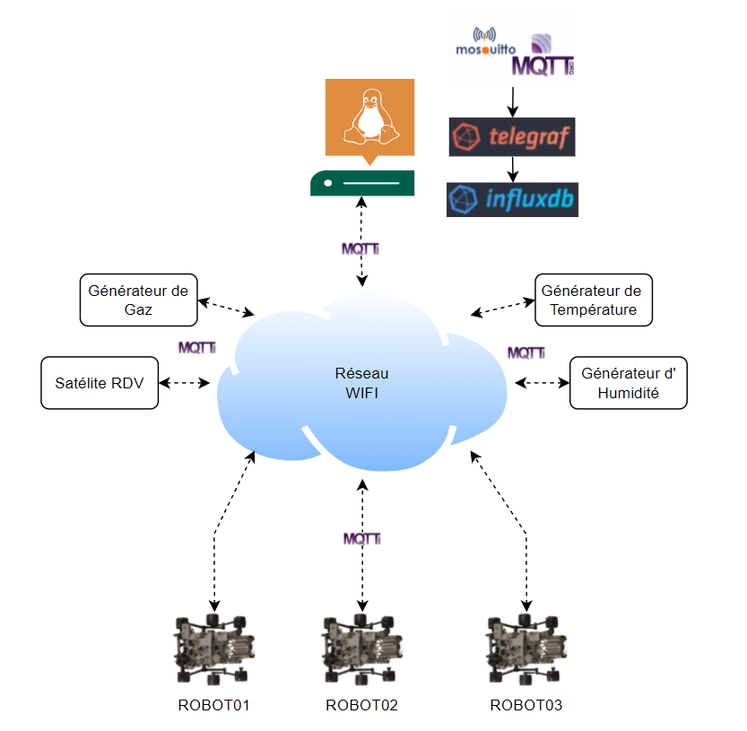
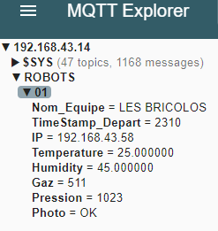
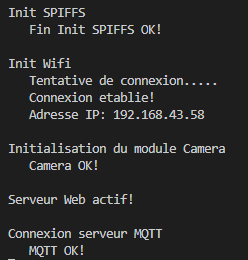
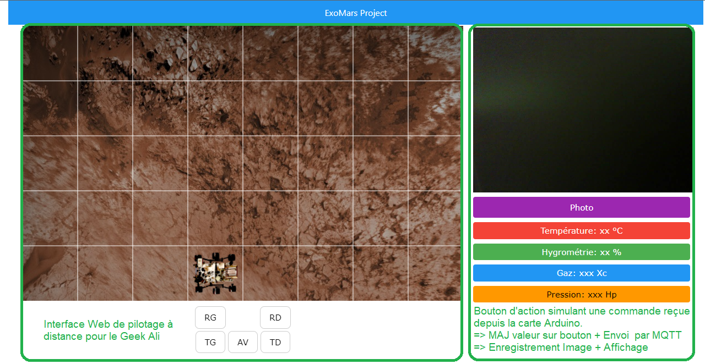
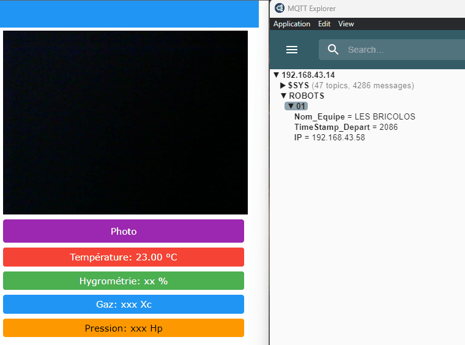

# POC : Mise en oeuvre de la carte µC ESPCAM
## Contexte : 
Pour notre compétition ‘volcano Robot’ le robot ExoMars doit pouvoir faire remonter ses mesures par Wifi à un serveur MQTT et doit pouvoir prendre une photo.
Ce même robot sera utilisé lors du GeekAli dans une animation/jeux et devra être piloté à distance par les visiteurs.


## Objectif :
1.   La carte ne contient pas d'interface USB, il convient donc d'utiliser un programmateur afin de téléverser notre code en mémoire et avoir un retour sur le moniteur Série
2.   Pouvoir utiliser la PSRAM comme une unité de disque avec un système de fichier afin de lire et sauvegarder des données
3. Prendre une photo, la stocker en mémoire non volatile afin de pouvoir la récupérer et éventuellement la transférer sur un serveur
4. Communication bidirectionnelle entre un Serveur et le robot en Wifi, par le protocole MQTT
5. Héberger une interface WEB asynchrone afin de piloter le robot et visualiser les valeurs des capteurs

Description de la carte :  [ESPCAM-AI-THINKER]

# 1. Programmateur & retour infos sur moniteur Série
La carte ESPCAM ne contient pas d'interface USB, il convient d'utiliser : 
- Programmateur FT232RL GT1125: https://www.gotronic.fr/pj2-35183-1542.pdf
    - Placer le sélecteur sur la tension 3,3V
    - Avant de lancer un téléversement, raccorder la broche IO0 à la masse et appuyer sur le bouton reset
    - Une fois la programmation effectuée, déconnecter la broche IO0 et appuyer sur le bouton reset
    - RAS pour le retour d'information par moniteur série, juste bien rebooter au préalable la carte sans la connexion sur la broche IO0

# 2. Système de fichiers SPIFFS
Bien qu'un nouveau système de fichier existe `LittleFS`, j'ai choisi d'utiliser `SPIFFS` car il reste largement utilisé sur les µC de type ESP, intégré nativement dans l'extension `Plateform IO` et utilisé par défaut dans la librairie du serveur Web Asynchrone (voir 4.)

### Intégration dans le projet :
La librairie est une dépendance pour le serveur Web Asynchrone, ajouter le lien suivant dans platformio.ini : 

```
lib_deps = https://github.com/me-no-dev/ESPAsyncWebServer.git
```

Platform IO met à disposition des outils pour intégrer des fichiers dans le system file afin de pouvoir les lires et les modifier depuis notre code source.

- Il convient de placer l'ensemble des fichiers dans le `.\data` du projet platformIO
<p >
    
</p>

- Générer l'image du système file par le menu `Build Filesystem Image`
- Et enfin le téléverser dans la mémoire de l'ESP par le menu `Upload Filesystem Image`
<p >
    
</p>

### Dans le code Source :
Inclure la librairie : ```#include <SPIFFS.h>```

Puis dans le setup() initialiser le système de fichiers :

```C
// Initialisation du gestionnaire de fichier SPIFFS
    Serial.println("\nInit SPIFFS");
    if ( !SPIFFS.begin() ) {
        Serial.println("   Erreur SPIFFS...");
        return;
    }
    Serial.println("   Fin Init SPIFFS OK!");
```

# 3. Prise de photo et stockage
l'ESPCAM comprend un Capteur OV2640 2MP avec les résolutions suivantes :
- FRAMESIZE_QVGA (320 x 240)
- FRAMESIZE_CIF (352 x 288)
- FRAMESIZE_VGA (640 x 480)
- FRAMESIZE_SVGA (800 x 600)
- FRAMESIZE_XGA (1024 x 768)
- FRAMESIZE_SXGA (1280 x 1024)
- FRAMESIZE_UXGA (1600 x 1200)

### Intégration dans le projet :
Ajouter le lien suivant dans platformio.ini : 

```
lib_deps = lib_deps = yoursunny/esp32cam @ ^0.0.20221229
```
### Dans le code Source :
Inclure les librairies : 
```C
// Camera libraries
#include "esp_camera.h"
#include "soc/soc.h"
#include "soc/rtc_cntl_reg.h"
#include "driver/rtc_io.h"
#include <configCamera.h>
```

Le paramétrage de la caméra a été placé dans le fichier `./include/confiCamera.h`
et contient les définitions des constantes ainsi que la fonction d'initialisation.

Dans le setup() initialiser la caméra :
```C
// Initialisation de la camera
    Serial.println("\nInitialisation du module Camera");
    configESPCamera();
    Serial.println("   Camera OK!");  
```

La fonction `esp_camera_fb_get()` nous renvoie un objet de type `camera_fb_t` avec les attributs suivants :
- buffer : l'image au format compressé jpeg suivant le paramétrage défini 
- len : la taille de l'image

Cela permet de l'enregistrer dans un fichier grâce à la librairie SPIFFS
Il convient de vider le buffer de l'image une fois l'image traitée grâce à la fonction `esp_camera_fb_return()`

Voici le code pour l'enregistrement de la photo dans un fichier SPIFFS :
```C
        fb = esp_camera_fb_get();
        if (!fb) {
            Serial.println("Failed");
        }
        else {
            File file = SPIFFS.open("/photo.jpg", FILE_WRITE);
            if (!file) {
                Serial.println("Failed to open file in writing mode");
            }
            else {
                file.write(fb->buf, fb->len); 
                Serial.print("The picture has been saved");
                Serial.print(" - Size: ");
                Serial.print(file.size());
                Serial.println(" bytes");
            }
            file.close();
            esp_camera_fb_return(fb);
```

J'ai pour le moment choisi la résolution SVGA qui nous donne une image de 16 ko en 800 x 600.

# 4. Communication bidirectionnelle MQTT
- Protocole développé en interne chez IBM dans les années 90 pour une utilisation industrielle de télémétrie en lien avec la gestion des pipelines pétroliers
- 2010 : Diffusion d'une version libre par IBM
- 2014 : Standardisation OASIS (Organization for the Advancement of Structured Information Standards) 
- Il fonctionne sur le principe de `Topic`, simple chaine de caractères structurée hiérarchiquement, exemple : ROBOTS/01/HUMIDITY
- Possibilité de souscrire à un ensemble de topics grâce aux caractères jokers :
    - '+' pour un unique niveau hiérarchique
    - '#' multi-niveau toujours à la fin après un '/'

Tous les détails du protocole ici : https://mqtt.org/

### Architecture mise en place :
<p >
    
</p>

- Le réseau WIFI sera fourni par la cité du Volcan, sur la bande 2,4Ghz
- Le serveur sera hébergé sur l'infrastructure de la cité du Volcan, 
    - Sous Linux 
    - Nous aurons l'implémentation de MQTT par `Mosquitto`
    - Le service `Telegraph` effectuera la passerelle entre les publications MQTT et leur enregistrement dans la base de donnée
    - La base de donnée sera sous `infludb`. C'est une base NO SQL de type TSDB (time series database), qui contient des séries temporelles. Cela nous permettra de comparer facilement les données transmises par les robots et le retour des capteurs au moment précis de la mesure.
    - *Pour le POC, j'ai utilisé une Raspberry Pi 4 avec le hostname BROKER974*
    - Le paramétrage et les outils du serveur sont à la charge de @Yannick qui pourra faire évoluer cette configuration
- Nos générateurs de grandeur physique à mesurer par les robots seront pilotés et leurs valeurs de contrôle remontés, par MQTT
- Les robots de chaque équipe se connecterons au serveur MQTT au démarrage 
    - En remontant leur Nom d'équipe, adresse IP et TimeStamp de départ. Puis au fur et à mesure de leur parcours, les données physiques mesurées
    - Ils seront abonné au topic `ctrled` nous permettant de visualiser l'ensemble des robots connectés au serveur par l'allumage de leur Flash Led sur l'ESPCAM
- L'outil `MQTT-Explorer` http://mqtt-explorer.com/ permet de visualiser et publier des `topics` sur un serveur MQTT
- La connexion au serveur MQTT est protégé par un 'login / Mot de passe', il ne me semble pas nécessaire de crypter les échanges par TLS.

Exemple de `topic` visualisé par MQTT-Explorer :
<p >
    
</p>

# 5. Serveur Web Asynchrone
Pas nécessaire pour notre projet de compétition 'Volcano Robot', cette brique permettra de piloter à distance le robot pour notre Stand au GeekAli, et m'a servi d'interface graphique lors de ce POC.

Tous les détails de mise en oeuvre se trouvent ici : [Tommy-Desrochers]

L'ensemble des `web Handle` se trouve dans le fichier `./include/webHandle.h`

# Description du Résultat
### Initialisation de l'ESPCAM
<p >
    
</p>

### Page web hebergée sur l'ESPCAM
<p >
    
</p>

### Démonstration
<p >
    
</p>

- A gauche la page web hébergée par l'ESPCAM
- A droite les topics du serveur MQTT

Lors du clic sur un bouton de l'interface Web, une mesure est effectuée par le capteur (ici une valeur aléatoire) qui est envoyée sur le serveur MQTT (à droite) et MAJ sur l'interface Web de manière asynchrone (sans rechargement complet de la page).


Pour rappel, les objectifs étaient les suivants :

1.   La carte ne contient pas d'interface USB, il convient donc d'utiliser un programmateur afin de téléverser notre code en mémoire et avoir un retour sur le moniteur Série
```
    - Le code ainsi que le file system sont bien téléversés dans l'ESPCAM
    - Nous avons un retour d'information sur le moniteur Série
```

2.   Pouvoir utiliser la PSRAM comme une unité de disque avec un système de fichier afin de lire et sauvegarder des données
```C
/*
    - Les fichiers de la page Web sont stockés dans la mémoire de l'ESPCAM par SPIFFS
    - La photo prise est enregistrée comme fichier dans la mémoire de l'ESPCAM par SPIFFS
*/
```
3. Prendre une photo, la stocker en mémoire non volatile afin de pouvoir la récupérer et éventuellement la transférer sur un serveur
```C
/*
    - La prise de photo est effective avec pilotage de la flash Led
    - La photo prise est enregistrée comme fichier dans la mémoire de l'ESPCAM par SPIFFS
*/
```
4. Communication bidirectionnelle entre un Serveur et le robot en Wifi, par le protocole MQTT
```css
/*
    - Publication des données du robot sur le serveur MQTT
    - Abonnement du robot à un topic de contrôle de la LED
*/
```
5. Héberger une interface WEB asynchrone afin de piloter le robot et visualiser les valeurs des capteurs
```C
/*
    - La page Web avec les fichiers html, css et js sont bien stockés et hébergés par le serveur web Asynchrone de l'ESPCAM
*/
```

[Robotic974]:      https://www.facebook.com/robotic974
[Nao974]:          https://www.youtube.com/@Nao974Robotic

[ESPCAM-AI-THINKER]: ./assets/MCU_ESPCAM-AI-THINKER.md
[Tommy-Desrochers]: https://tommydesrochers.com/la-meilleure-methode-pour-heberger-une-interface-web-sur-esp32-version-avancee-esp32-ep4/

