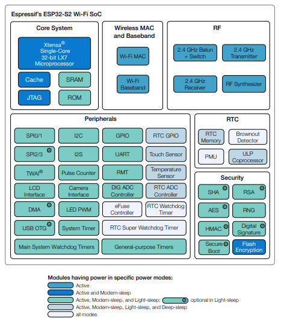
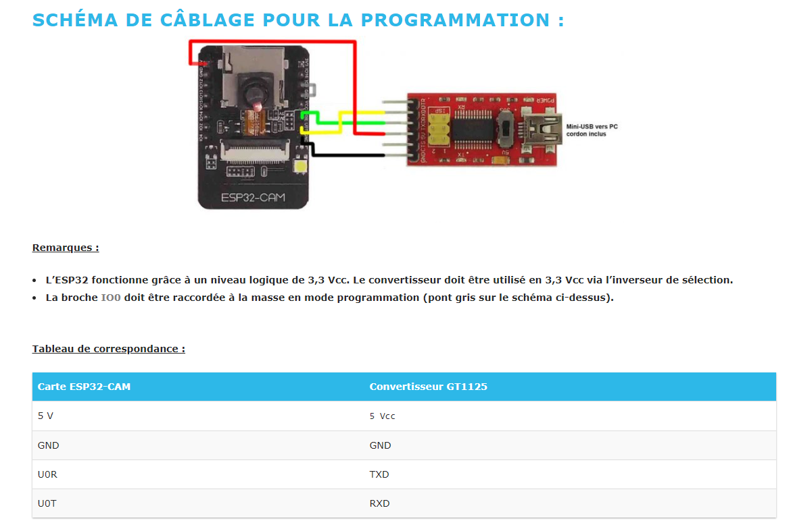

# ESP32CAM AI THINKER
- https://www.gotronic.fr/blog/guides/utilisation-du-module-eps32-cam-avec-arduino/
- ESP32-S2 embedded
    - https://www.espressif.com/sites/default/files/documentation/esp32-s2_datasheet_en.pdf
    - Xtensa® single-core 32-bit LX7 microprocessor, up to 240 MHz
    - Flash RAM: 320KB
    - PSRAM: 4MB
    - Wifi & BLE
- Capteur OV2640
- LED blanche CMS haute luminausité Flashlight (GPIO 4)
- Lecteur de carte micro-SD 4 Go maxi
    - !!! Broches utilisées par le lecteur micro-SD: 2, 4, 12, 13, 14 et 15
- Antenne µFL
- PInOUT : https://randomnerdtutorials.com/esp32-cam-ai-thinker-pinout/

- Functional_Block_Diagram
<p >
    
</p>

- Un convertisseur USB vers série GT1125
    - driver Windows: https://ftdichip.com/drivers/vcp-drivers/
<p >
    
</p>

```
; Environnement dans platform.ini
[env:esp32cam]
platform = espressif32
board = esp32cam
framework = arduino
```

[Retour]

[Retour]: ../Readme.md
